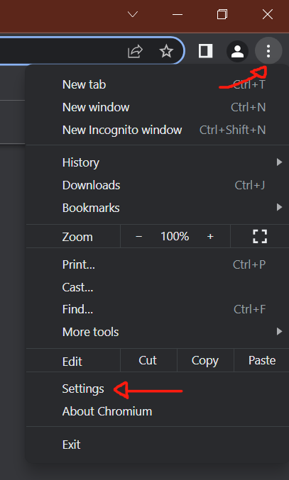
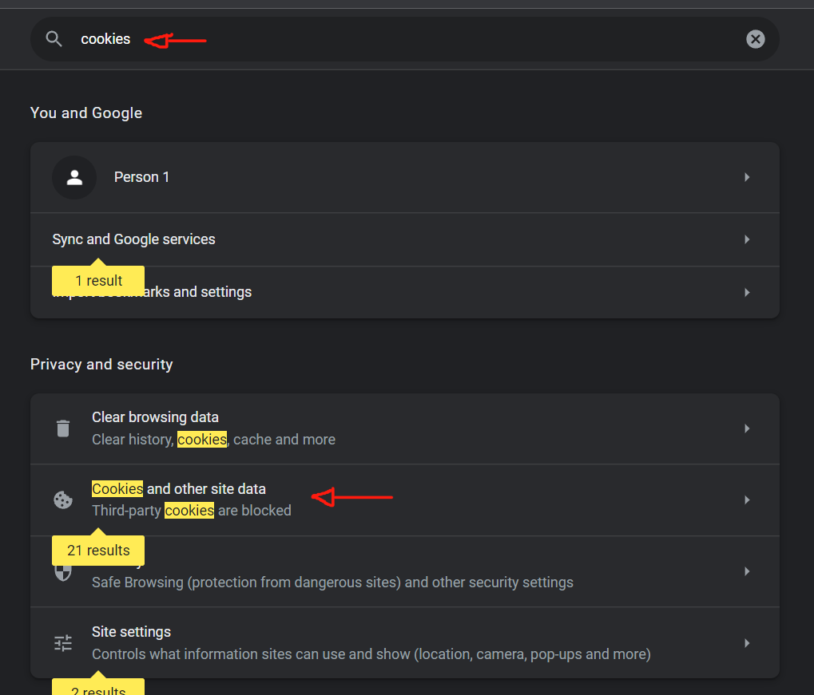
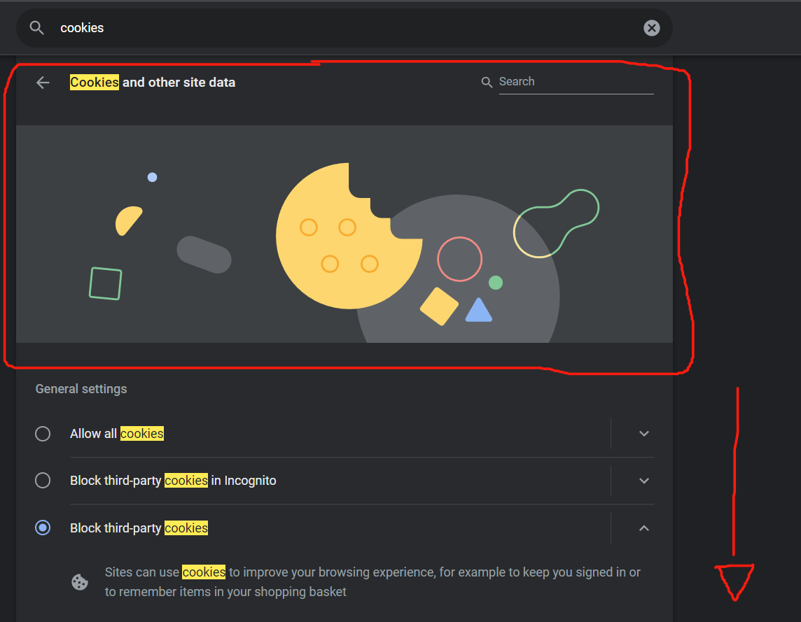
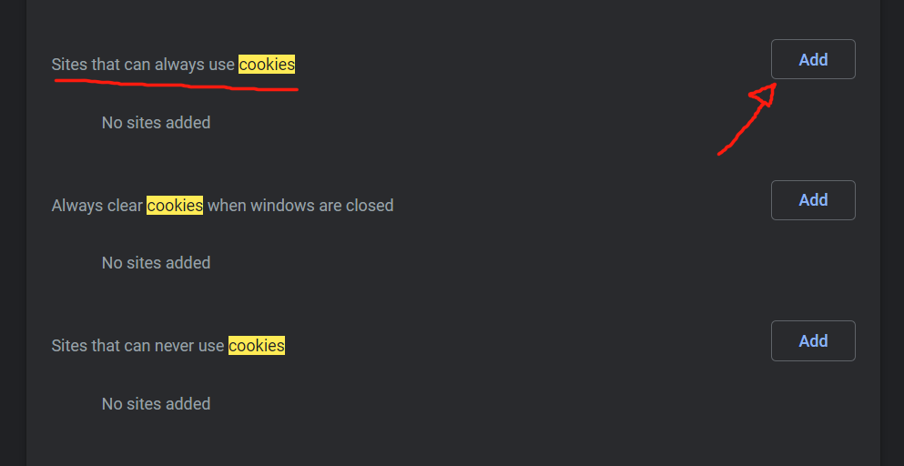
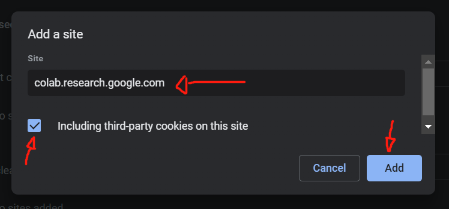

# Guide if you got Error 403
### Works on Chromium based browser (Including Bromite)

- Click the three dots on the upper right corner and then click settings

  

- Type `cookies` on the settings search bar and then click the **"Cookies and other site data"** options

  

- When you arrived on the **"Cookies and other site data"** menu, scroll down

  

- Look for **"Sites that can always use cookies"** option, and then click the **"Add"** button

  

- Type `colab.research.google.com` and tick the **"Including third-party cookies on this site"** checkbox, and then click the **"Add"** button

  

- You're done. Restart the colab (the runtime) and see if it now works
